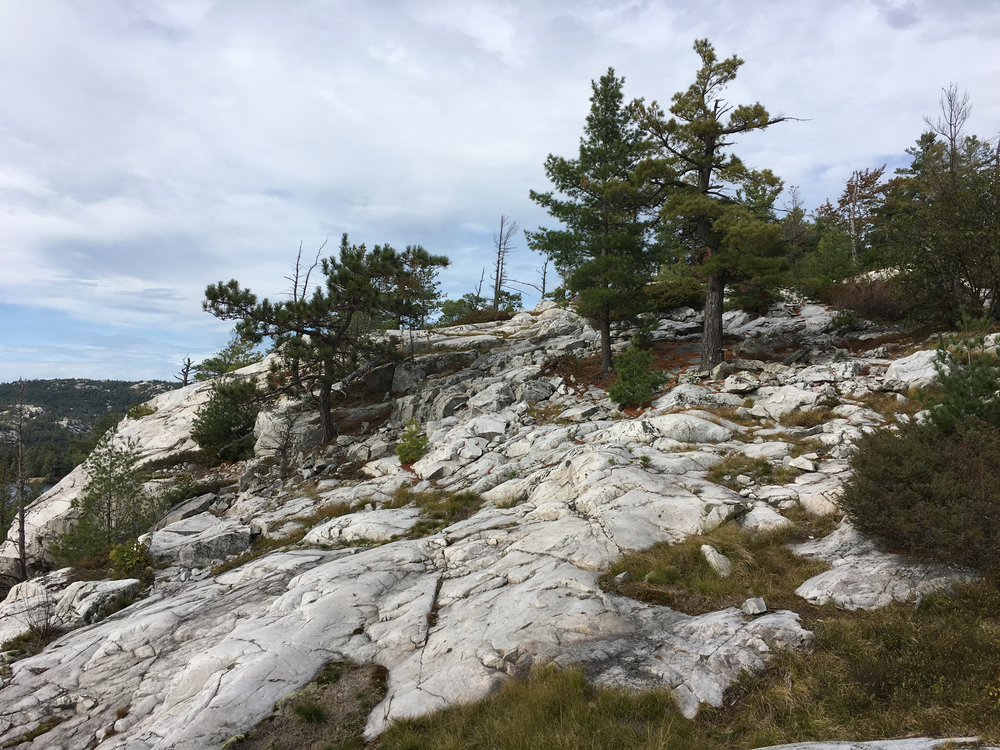
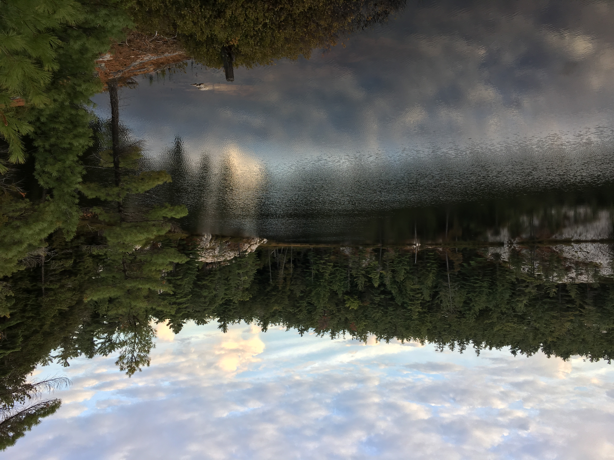
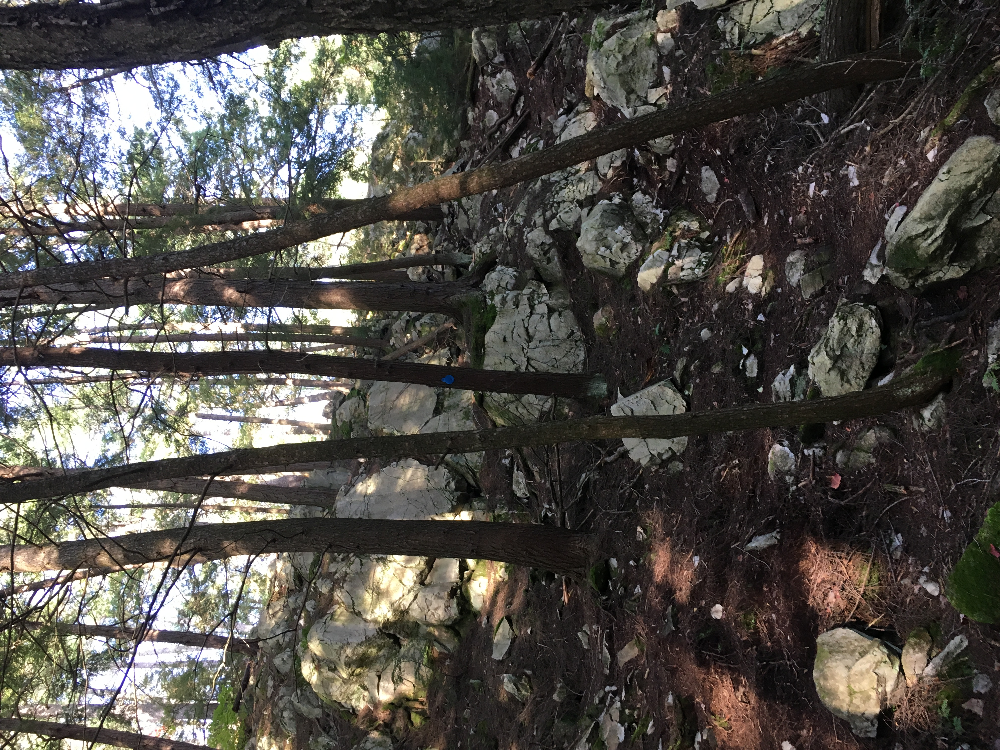
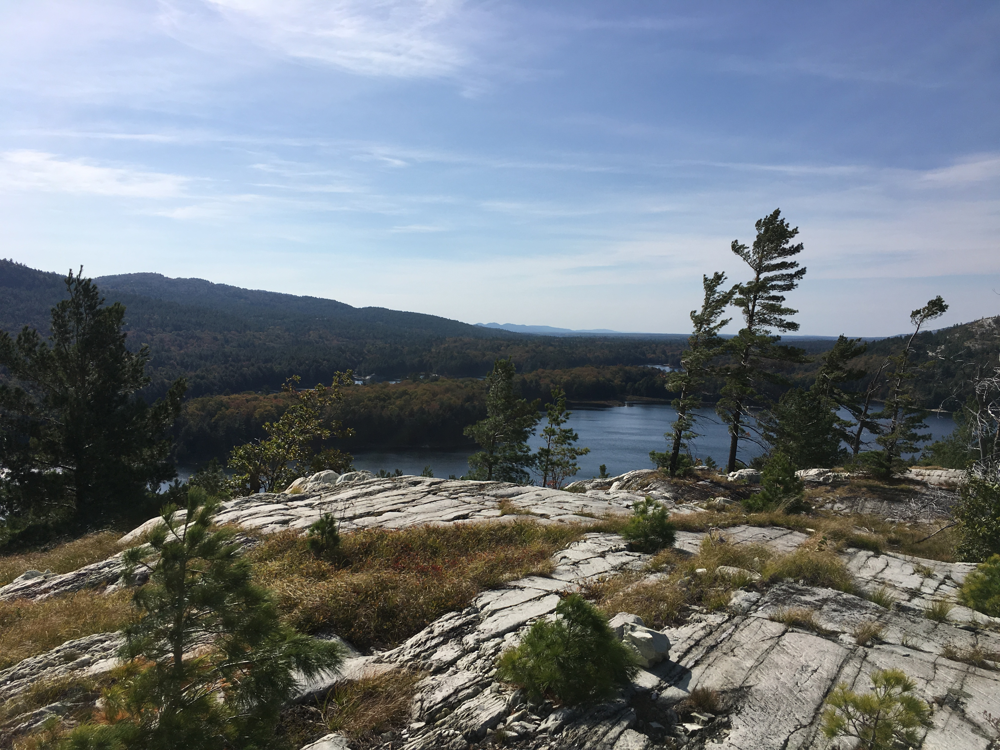
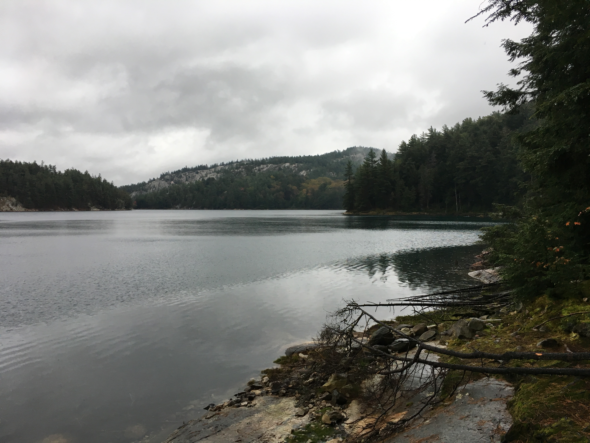
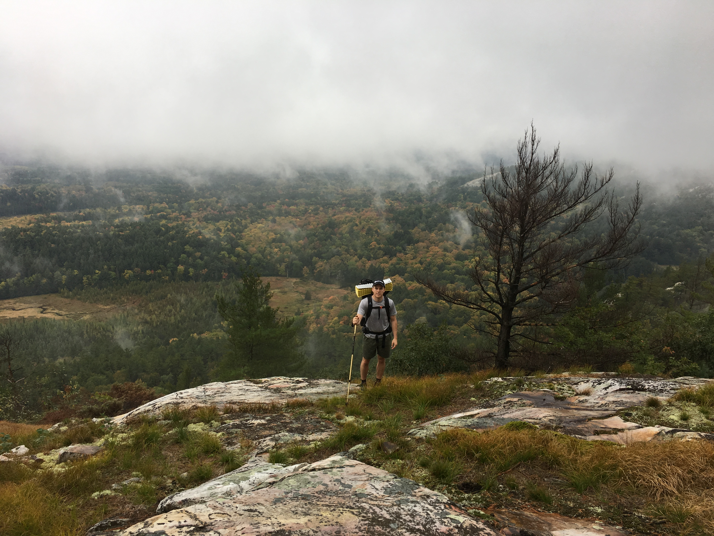
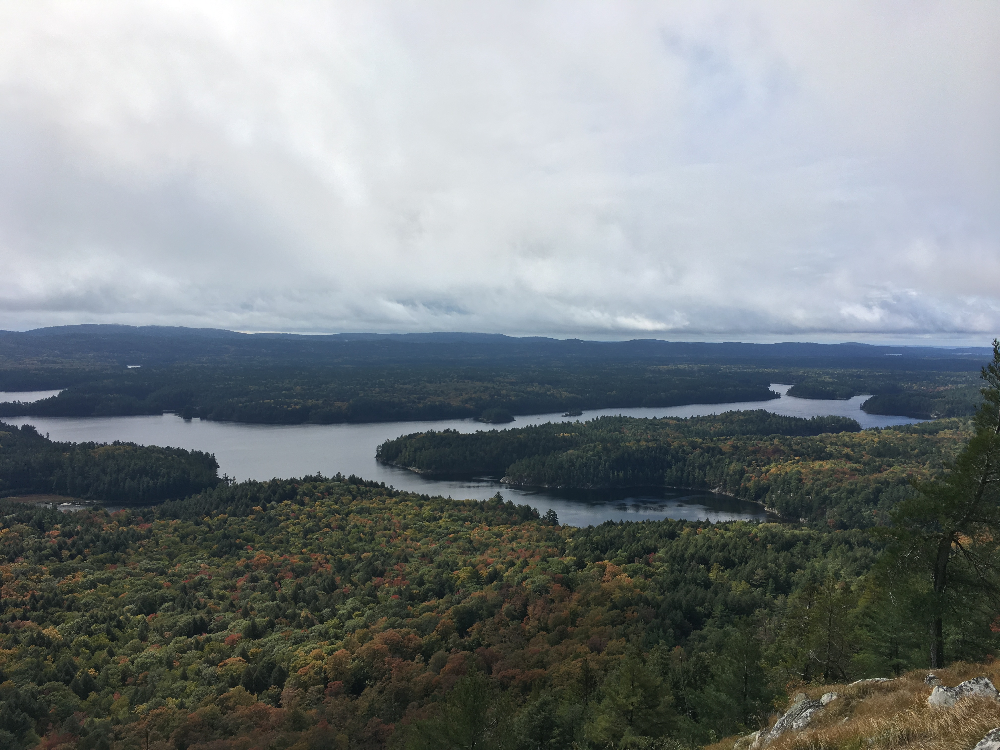
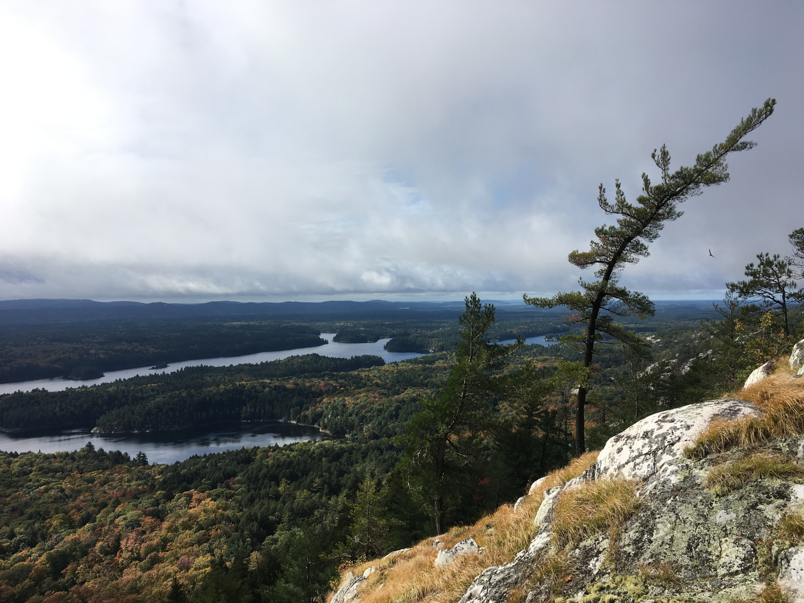
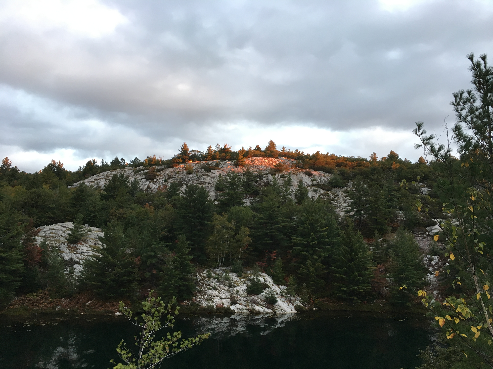
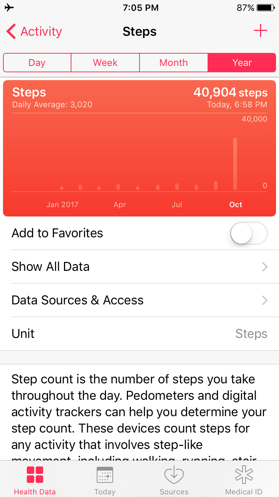

## Day 1 - George Lake to H47

<!-- add image -->

<!-- add image -->

<!-- add image -->

## Day 2 - H47 to (almost) H31

<!-- add image -->

<!-- add image -->

<!-- add image -->

<!-- add image -->

## Day 3 - H31 to H22 

<!-- add image -->

<!-- add image -->

<!-- add image -->

<!-- add image -->

<!-- add image -->

<!-- add image -->

## Day 4 - H22 to H6

<!-- add image -->

<!-- add image -->

## Day 5 - H6 to George Lake

<!-- add image -->

<!-- add image -->

<!-- add image -->

